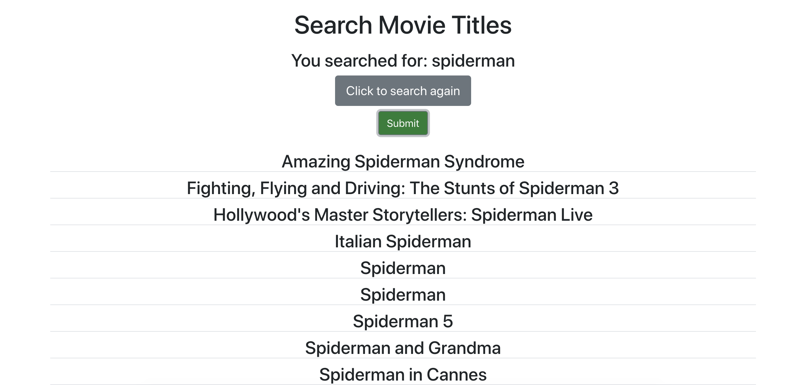

# ttd-frontend-test (Frontend)

ttd-frontend-test is basically a technical coding test project where I build the frontend of a small single page application to fetch data of movie titles from given API. I then do a Ascending Sorting for all the datas collected and show it to the main page.

## Snapshot of Web App : 

Above, I do a search for the keyword "spiderman" and then the web app return us back the data fetched from API after going through sorting ascendingly before printing it out on the page.

## REQUIREMENTS

For development, you will need to install `Node.js` on your environment.

#### Node installation on OS X

1. Open the Terminal App and type brew install node.
2. Wait while Homebrew helps you download and install all the needed files for you to use.

After installing, you can check whether Node.js has been installed by typing `node-v` in terminal. Also to see if NPM is installed already, by typing `npm -v`

#### Node installation on Linux

On terminal, type in : 
`sudo apt-get install nodejs`

#### Node installation on Windows 

Go to [https://nodejs.org/en/download/](https://nodejs.org/en/download/) and follow all the steps to download.

## INSTALL

`$ git clone git@github.com:hendriagustino/ttd-frontend-test.git`  
`$ cd ttd-frontend-test`  
`$ npm install`

# START 

`$ npm start`
